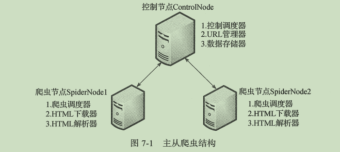
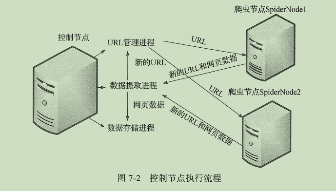

## 简单分布式爬虫

采用主从模式，共使用三台机器，一台主节点（控制节点），两台从节点（爬虫节点）

控制节点功能：
   - URL管理器
   - 数据存储器
   - 控制调度器
   
爬虫节点：
    - 爬虫调度器
    - HTML解析器
    - HTML下载器

控制流程

控制调度器
- 主要产生并启动URL管理进程、数据提取进程和数据存储进程
- 维护4个队列保持进程间的通信，分别为：
    - url_q: 将URL传递给爬虫节点
    - result_q：爬虫节点将数据返回给数据提取进程
    - conn_q：将从数据提取出的新URL提交给URL管理进程
    - store_q：将从数据提取出的data提交成数据存储进程
